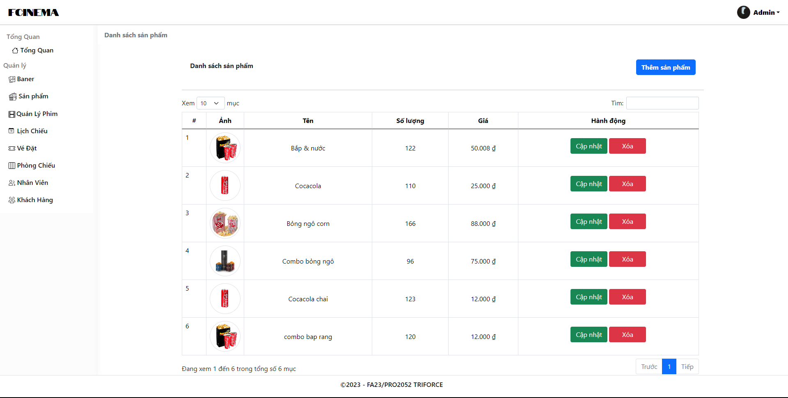

# FALL23/PRO2052/MD17302/PRO2052-TRIFORCE
# FCinema Server
FCinema Server là một web server để quản lý rạp phim. Web server sử dụng Node.js, Handlebars template, Bootstrap 5 và Java cho phía [client](https://github.com/DoannNguyen/FCINEMA_App). Database sử dụng là MySQL. Cloud sử dụng để lưu trữ ảnh là Cloudinary.

## Thành viên

| STT | Họ và tên | Task|
|---|---| --- |
| 1 | Nguyễn Văn Đoàn |Viết API cho liên quan đến chức năng phim - vé cho phía client.
| 2 | A Hà Anh Tú | Quản lý loại phim - phim, quản lý nhân viên, tài khoản.
| 3 | Trần Duy Tặng |Giao diện cho phần đăng nhập, phòng chiếu, khách hàng (1).
| 4 | Lô Tiến Đạt  |Vé đặt, thống kê, sản phẩm, baner, viết mã cho các chức năng (1), viết API liên quan đến tài khoản của người dùng phía client.

## Chức năng chính
1. Đăng nhập, phân quyền (Admin có thể thực hiện được tất cả các chức năng, nhân viên chỉ có thể thực hiện chức năng vé đặt và tài khoản)
2. Thêm, xem, cập nhật, xoá loại phim-phim
3. Thêm, xem, cập nhật, xoá sản phẩm
4. Thêm, xem, cập nhật lịch chiếu
5. Thêm, xem vé đặt
6. Thống kê doanh thu (qua 12 tháng, qua tháng, qua 7 ngày) và các thống kê liên quan (tồn kho sản phẩm, phim, lịch chiếu, vé...)
## Một số giao diện

| |
|---|
|<h4 align="center">Giao diện màn hình đăng nhập</h4> |
<h4 align="center">Giao diện màn hình tổng quan</h4> |
<h4 align="center">Giao diện màn hình tổng quan (chi tiết phần thống kê)</h4> |
<h4 align="center">Giao diện màn hình vé đặt</h4> |
<h4 align="center">Giao diện màn hình thêm vé đặt</h4> |
<h4 align="center">Giao diện màn hình thêm vé đặt</h4> |
<h4 align="center">Giao diện màn hình chi tiết vé đặt</h4> |
<h4 align="center">Giao diện màn hình phim</h4> |
<h4 align="center">Giao diện màn hình lịch chiếu</h4> |
<h4 align="center">Giao diện màn hình sản phẩm</h4> |
<h4 align="center">Giao diện màn hình tài khoản</h4> |
<h4 align="center">Giao diện modal đổi mật khẩu </h4> |
<h4 align="center">Giao diện màn hình thêm phim/h4> |
<h4 align="center">Giao diện màn hình thêm lịch chiếu/h4> |
<h4 align="center">Giao diện modal thêm</h4> |
<h4 align="center">Giao diện modal xoá</h4> |
